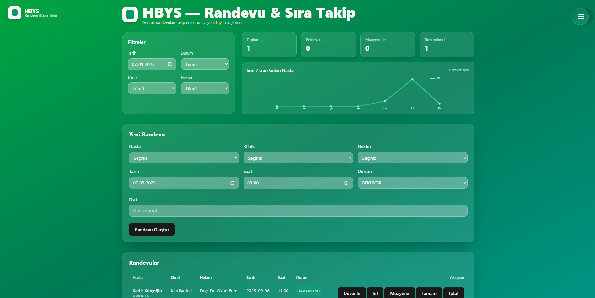
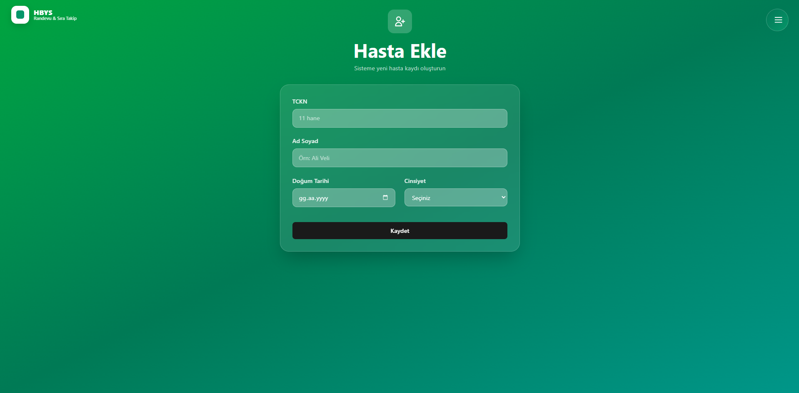
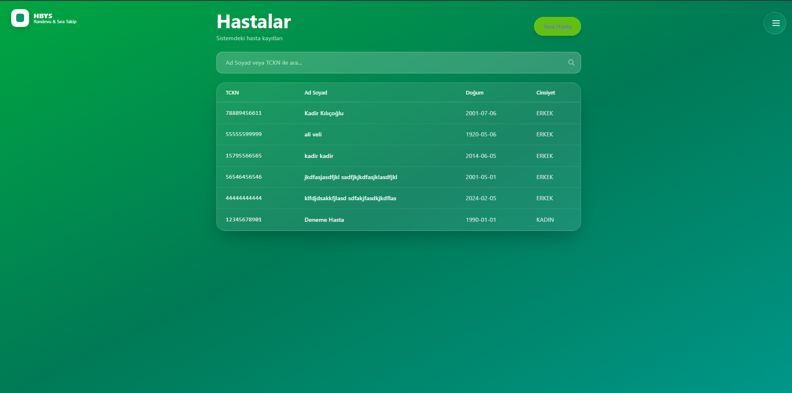
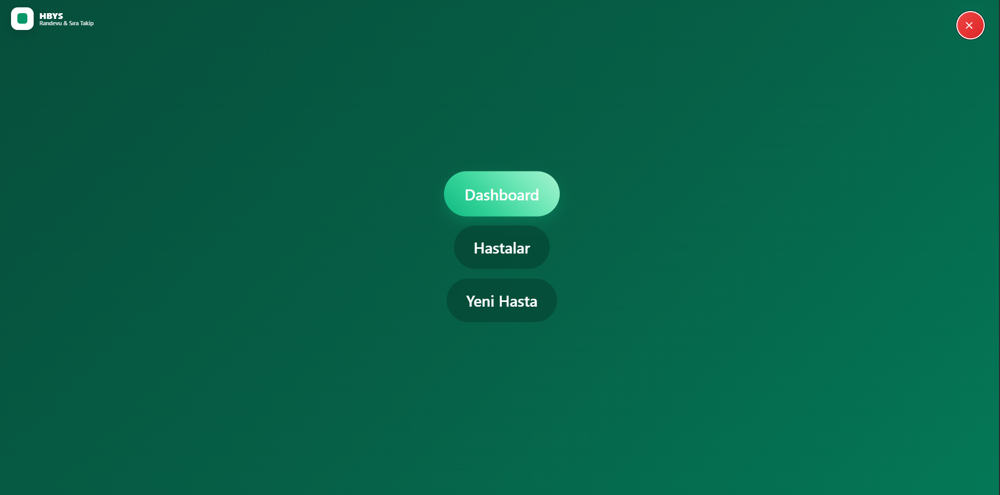

# HBYS – Randevu & Sıra Takip Sistemi

Hastane Bilgi Yönetim Sistemi’nin (HBYS) bir modülü olan **Randevu & Sıra Takip Sistemi**, hasta kayıtlarını, doktor-klinik yönetimini ve randevu süreçlerini kolaylaştırmak için geliştirilmiştir.

## 🚀 Özellikler

* 👤 **Hasta Yönetimi**

  * TCKN bazlı benzersiz kimlik ile hasta kaydı
  * Hasta listesi & arama özelliği

* 🏥 **Randevu Yönetimi**

  * Randevu oluşturma, güncelleme, silme
  * Klinik ve doktora göre filtreleme
  * Durum takibi: **Bekleyen · Muayenede · Tamamlandı · İptal**

* 📊 **Dashboard**

  * Günlük randevu listesi
  * İstatistikler (toplam, bekleyen, muayenede vb.)
  * Yeni hasta kaydı sonrası otomatik seçim entegrasyonu

## 🛠 Kullanılan Teknolojiler

**Backend:**

* Node.js
* Express.js
* Prisma ORM
* SQLite

**Frontend:**

* React (Vite)
* React Router
* Tailwind CSS

**Diğer:**

* Zod (Validation)
* RESTful API Tasarımı

## 📂 Proje Yapısı

```
hbys_project/
│
├── hbys-api/               # Backend (Express + Prisma)
│   ├── prisma/             # Prisma şema & seed
│   ├── src/                # API route’ları
│   └── package.json
│
├── hbys-panel/             # Frontend (React + Vite)
│   ├── src/
│   │   ├── pages/          # Dashboard, Patients, Admin paneli
│   │   ├── components/     # UI bileşenleri
│   │   └── lib/
│   │       └── api.js      # API servisleri
│   └── package.json
│
└── README.md
```

## ⚡ Kurulum

### 1. Backend

```bash
cd hbys-panel/hbys-api

# Bağımlılıkları yükle
npm install

# Prisma client üret
npx prisma generate

# Veritabanı migrate et
npm run migrate -- --name init

# Seed verilerini yükle
npm run seed

# Sunucuyu başlat
npm run dev
```

API varsayılan olarak `http://localhost:5000` adresinde çalışır.

### 2. Frontend

```bash
cd hbys-panel

# Bağımlılıkları yükle
npm install

# Geliştirme sunucusunu çalıştır
npm run dev
```

Frontend varsayılan olarak `http://localhost:5173` adresinde çalışır.

## 🔗 API Endpoint’leri

* `GET /health` → Sağlık kontrolü
* `GET /api/clinics` → Klinik listesi
* `GET /api/doctors` → Doktor listesi
* `GET /api/patients` → Hasta listesi
* `POST /api/patients` → Yeni hasta oluştur
* `GET /api/appointments` → Randevu listesi
* `POST /api/appointments` → Yeni randevu oluştur
* `PUT /api/appointments/:id` → Randevu güncelle
* `DELETE /api/appointments/:id` → Randevu sil

## 📸 Ekran Görüntüleri






```

## 📌 Katkı

Katkılarınızı bekliyorum! Fork’layabilir, PR gönderebilirsiniz.

## 📎 Bağlantılar

🔗 GitHub Repo: [hbys\_project](https://github.com/kadirkilicoglu/hbys_project)


